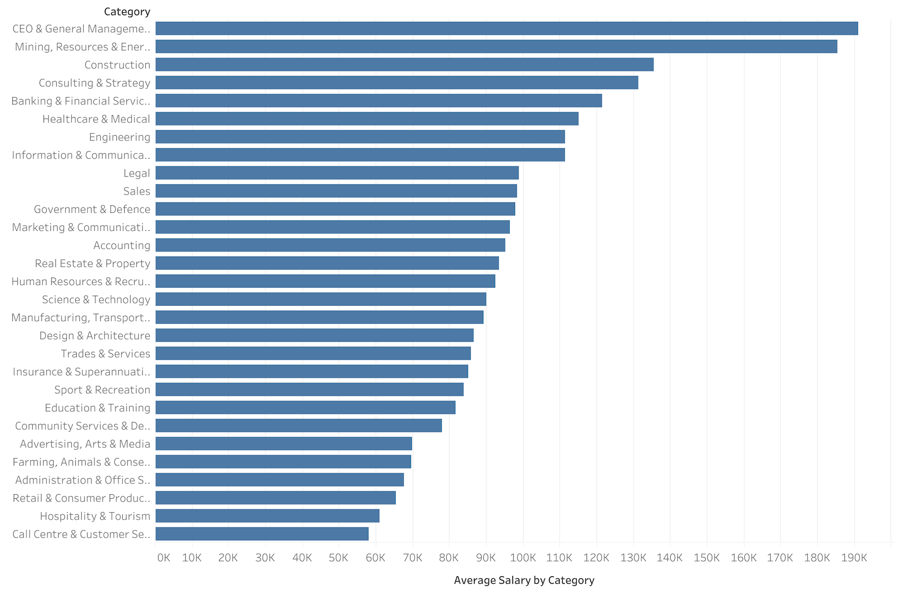
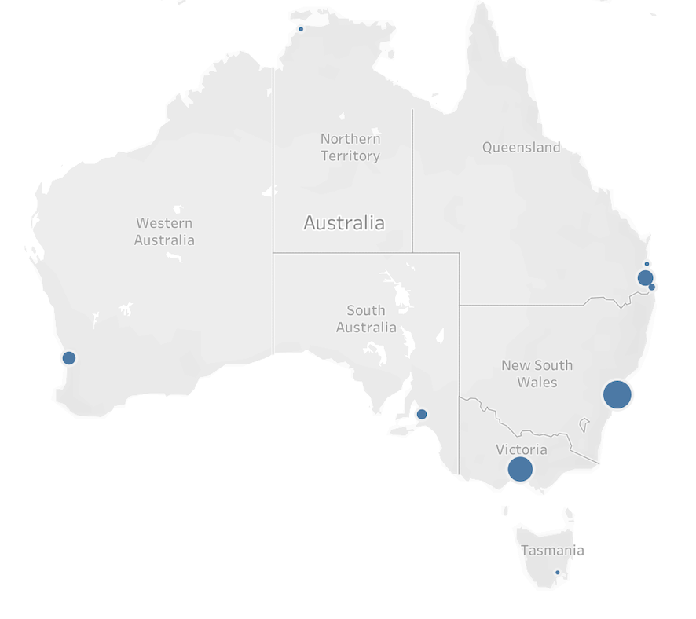
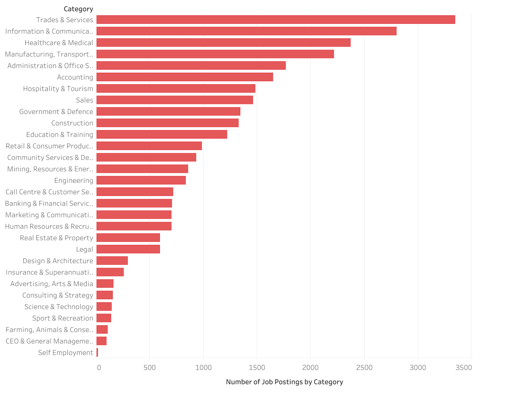

# Australian-Job-Market-Analysis

This project analyzes the Australian job market using the [Job Trends in Australia dataset](https://www.kaggle.com/datasets/thedevastator/job-trends-in-australia) available on Kaggle, which contains 30,000 job postings collected from SEEK Australia, one of the country's largest employment platforms.

The analysis focuses on employment trends, geographical distribution of job opportunities, job categories, and salary information. A major challenge of the project was the poor quality of salary data, which required extensive preprocessing before meaningful analysis could be performed.

The project was developed using Microsoft Excel for data cleaning and Tableau Public for data visualization.

---

## Technologies Used

* Tableau Public
* Microsoft Excel
* Kaggle Dataset
* Data Cleaning and Preprocessing
* Exploratory Data Analysis (EDA)

---

## Dataset

The original dataset contains 30,000 job postings from SEEK Australia.

For this analysis, only the following variables were retained:

* `category`
* `city`
* `job_type`
* `salary_offered`

The remaining features were removed to focus the analysis on labor market characteristics and salary trends.

---

## Data Preprocessing

### Salary Data Quality Issues

The `salary_offered` column presented several challenges:

* **21,055 rows** contained missing values (empty cells)
* Only **55 rows** originally contained directly analyzable numerical salary values
* The remaining **8890** salary entries were stored as unstructured text strings

Examples included:

* `$120k + Superannuation`
* `100,502 - 114,624`
* `80k + Benefits`

As a result, only 0.6% of non-missing salary entries were initially analyzable.

---

### Salary Standardization

To improve salary coverage, several preprocessing steps were performed in Microsoft Excel before importing the dataset into Tableau.

#### 1. Salary Abbreviation Standardization

Salary abbreviations such as `k` and `K` were converted into full numerical values.

Example:

* `80k` → `80,000`

#### 2. Removal of Non-Numerical Text

Non-numerical elements were removed, including:

- `Superannuation`
- `Super`
- `Benefits`
- `p.a.`
- `year`
- `AUD`
- `$`
- `+`

Example:

* `$40,000 + Super` → `40,000`

#### 3. Salary Range Conversion

Salary ranges were converted into midpoint values.

Example:

* `100,502 - 114,624` → `107,563`

---

### Preprocessing Results

The preprocessing phase substantially increased the amount of usable salary information.

* Analyzable salary records increased from **55** to **1,719**
* Salary coverage increased from **0.6%** to **19,33%**

This improvement enabled meaningful salary-based analysis.

---

## Salary Analysis

### Outlier Detection

Several extremely large salary values were identified during the analysis, including three salaries of 120 million AUD, 110 million AUD, and 100 million AUD.

A manual inspection of the original records revealed that these observations originated from entries such as `100000k`. During the salary standardization process, the conversion of the `k` suffix into its numerical equivalent resulted in salary values exceeding 100 million AUD.

Although it is not possible to determine whether these records originated from typographical errors in the original job postings or from unusual compensation formats, their magnitude was considered unrealistic when compared to the rest of the salary distribution. Consequently, they were classified as unreliable observations and excluded from salary calculations.

After removing these extreme values, the highest salary offer in the dataset was **1.5 million AUD**, associated with a position in the **Banking & Financial Services** category located in **Sydney**.

Additionally, salary values below **10,000 AUD** were excluded because some records appeared to represent hourly, daily, or weekly compensation rather than annual salaries (for example, values such as `24` or `825`).

---

### Salary Statistics

After removing extreme outliers and implausible salary values:

* **Average salary:** 98,771 AUD
* **Median salary:** 87,500 AUD
* **Mode salary:** 107,563 AUD (130 occurrences)

The modal salary value frequently originated from salary ranges such as `100,502–114,624`, which were converted into midpoint values during preprocessing.

The difference between the mean and median salary suggests a right-skewed salary distribution, indicating the presence of a relatively small number of high-paying positions that increase the average salary.

---

### Highest Paying Categories

The highest average salaries were observed in:

* CEO & General Management — **191,070 AUD**
* Mining, Resources & Energy — **185,272 AUD**
* Construction — **135,451 AUD**
* Consulting & Strategy — **135,172 AUD**
* Banking & Financial Services — **121,493 AUD**

---

## Additional Insights

### Geographic Distribution

Sydney recorded the highest number of job postings (9,412), followed by Melbourne (7,361).

### Job Type

Full-Time employment was the most common job type, with more than 20,000 offers, representing the 67,34% of the total offers.

### Job Categories

The categories with the highest number of job postings were:

* Trades & Services — 3,346
* Information & Communication Technology — 2,802
* Healthcare & Medical — 2,371

---

# Limitations

Several limitations should be considered when interpreting the results:

A large portion of salary data remained unavailable or non-analyzable.

In fact 21,055 out of 30,000 job postings did not include salary information.

In addition, some salary entries could not be reliably converted into numerical values and were therefore excluded from salary analysis.

The preprocessing approach aimed to maximize analyzable salary coverage while preserving data consistency, but certain transformations may not perfectly reflect actual compensation structures.

Due to missing salary disclosure in many postings, the calculated salary statistics may not fully represent the broader Australian labor market.

---

# Conclusion

This project demonstrates how data preprocessing can significantly improve the analytical value of imperfect real-world datasets.

Despite the large amount of missing and inconsistent salary information, preprocessing techniques allowed a substantial increase in analyzable salary records, enabling more meaningful salary analysis and labor market insights.

The project also highlights the importance of handling outliers, missing values, and unstructured text data before conducting quantitative analysis.
